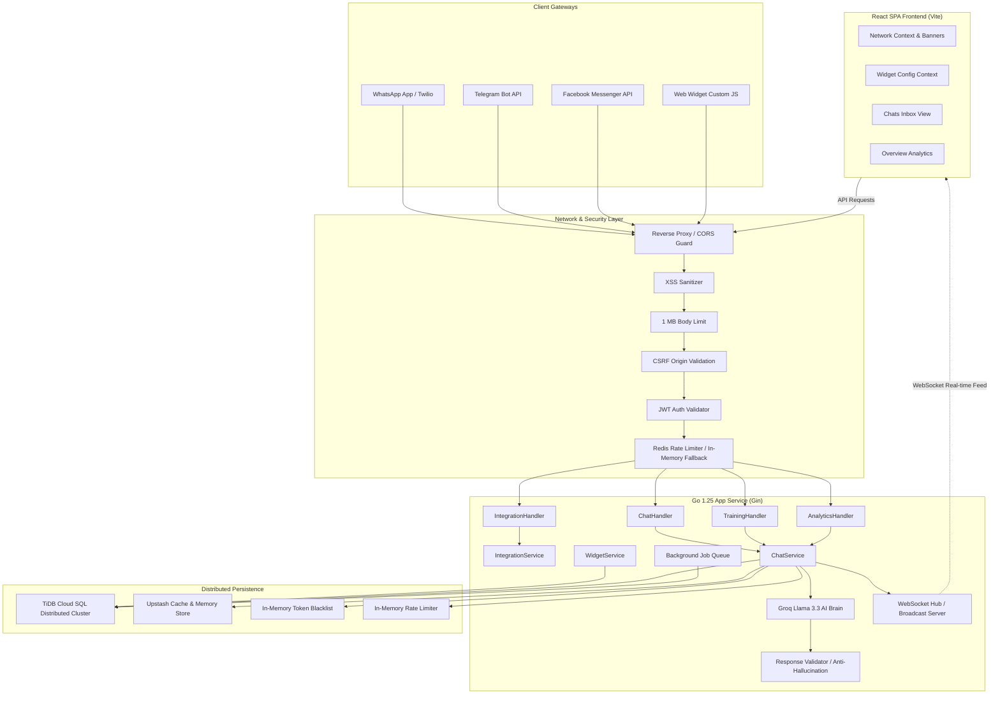
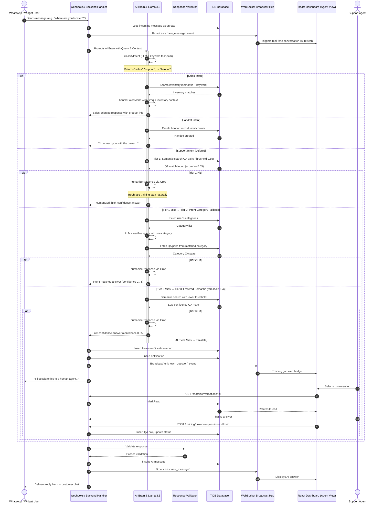
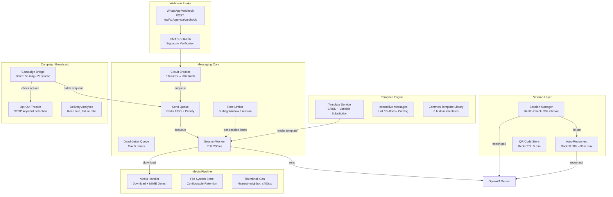

# NOANT Enterprise — v2.0

Autonomous & Human-in-the-Loop AI Customer Support Platform. Built in Nigeria. For the World.

---

## Table of Contents

1. [Overview](#overview)
2. [Technology Stack](#technology-stack)
3. [Project Structure](#project-structure)
4. [Architecture & System Topology](#architecture--system-topology)
5. [AI Orchestration Flow](#ai-orchestration-flow)
6. [Security Features](#security-features)
7. [Core Subsystems](#core-subsystems)
8. [Configuration Reference](#configuration-reference)
9. [Installation & Deployment](#installation--deployment)
10. [Testing](#testing)
11. [API Directory](#api-directory)
12. [Operations](#operations)
13. [Database Schema](#database-schema)

---

## Overview

NOANT Enterprise is a state-of-the-art, high-throughput, multi-tenant customer relationship and messaging platform. It features a **hybrid automation model** — balancing high-confidence AI answering capabilities with seamless, real-time human escalation across WhatsApp, Telegram, Facebook Messenger, and embedded Web Widgets.

### Brand Identity

The logo is modeled after an advanced conversation-loop icon:

- **Outer Dashed Ring** — Multi-channel messaging endpoints spinning in synchrony.
- **Solid Black Core** — Central AI Brain container.
- **Three White Dots** — Message propagation, growing as intelligence accumulates.

---

## Technology Stack

| Layer | Technology | Purpose |
|---|---|---|
| **Backend** | Go 1.25, Gin | HTTP API server, WebSocket hub, business logic |
| **Frontend** | React 18, TypeScript, Vite | Single-page application dashboard |
| **AI** | Groq Llama 3.3 (via REST API) | Natural language understanding & response generation |
| **Database** | TiDB Cloud (MySQL-compatible) | Distributed SQL for conversations, users, training data |
| **Cache & Queue** | Redis (Upstash) | Session tokens, rate limits, AI history, job queue |
| **Payments** | Polar API | Subscription & credit pack processing |
| **Embeddings** | Custom Go vector search | Semantic QA pair matching |
| **Deployment** | Render, Docker | Unified static + API server |

---

## Project Structure

```
noant/
├── backend/
│   ├── main.go                         # Entry point, router, middleware wiring
│   ├── config/
│   │   └── config.go                   # Environment-based configuration
│   ├── migrations/                     # SQL migration files (001–017)
│   ├── internal/
│   │   ├── domain/
│   │   │   └── models.go              # Core domain types (User, Conversation, etc.)
│   │   ├── errors/
│   │   │   └── errors.go              # Typed sentinel errors (ErrEmailNotVerified, etc.)
│   │   ├── infrastructure/
│   │   │   ├── db.go                  # TiDB connection pool
│   │   │   ├── redis.go              # Redis client wrapper
│   │   │   ├── cache.go              # Generic cache layer
│   │   │   ├── bottleneck.go         # Concurrency limiter
│   │   │   ├── jobqueue.go           # Background job scheduler
│   │   │   ├── blacklist.go          # In-memory token blacklist (Redis fallback)
│   │   │   ├── memory_ratelimit.go   # In-memory rate limiter (Redis fallback)
│   │   │   └── logger.go             # Structured logger
│   │   ├── middleware/
│   │   │   ├── auth.go               # JWT auth, CSP, rate limiting, token blacklist
│   │   │   ├── csrf.go               # Origin/Referer CSRF validation
│   │   │   ├── bodylimit.go          # 1 MB request body limit
│   │   │   ├── sanitize_middleware.go  # XSS sanitization middleware
│   │   │   ├── audit.go              # Request audit logging
│   │   │   └── websocket_auth.go     # WebSocket origin validation
│   │   ├── handler/                   # HTTP handlers (25 files, split by domain)
│   │   │   ├── handler.go            # Aggregator registering all routes
│   │   │   ├── auth_handler.go       # Registration, login, email verification
│   │   │   ├── chat_handler.go       # Conversations, messages, escalation
│   │   │   ├── training_handler.go   # QA pairs, categories, unknown questions
│   │   │   ├── analytics_handler.go  # Dashboard stats, insights
│   │   │   ├── integration_handler.go# Channel connection management
│   │   │   ├── settings_handler.go   # User preferences, notifications
│   │   │   ├── payment_handler.go    # Subscription, billing webhooks
│   │   │   ├── inventory_handler.go  # Product catalog CRUD
│   │   │   ├── handoff_handler.go    # Lead handoff management
│   │   │   ├── credit_handler.go     # Credit balance & purchases
│   │   │   ├── campaign_handler.go   # Broadcast campaigns
│   │   │   ├── openwa_handler.go     # WhatsApp webhook & admin
│   │   │   └── websocket.go          # WebSocket hub & connection management
│   │   ├── service/                   # Business logic (37 files, split by domain)
│   │   │   ├── service.go            # Aggregator constructing all services
│   │   │   ├── aibrain_core.go       # AI orchestration, intent classification, response gen
│   │   │   ├── auth.go               # Registration, login, JWT, 2FA, password reset
│   │   │   ├── chat.go               # Conversation CRUD, message handling
│   │   │   ├── training.go           # QA management, CSV import, unknown questions
│   │   │   ├── analytics.go          # Stats aggregation, insights generation
│   │   │   ├── integration.go        # Multi-channel connection logic
│   │   │   ├── settings.go           # User preferences, widget config
│   │   │   ├── payment.go            # Subscription, Polar webhooks
│   │   │   ├── inventory.go          # Product catalog operations
│   │   │   ├── handoff.go            # Lead handoff & escalation
│   │   │   ├── credit.go             # Credit balance management
│   │   │   ├── campaign.go           # Broadcast scheduling & delivery
│   │   │   ├── embedding.go          # Vector search & semantic QA matching
│   │   │   ├── openwa.go             # WhatsApp integration core
│   │   │   ├── openwa_queue.go       # Redis FIFO queue + rate limiter
│   │   │   ├── openwa_session.go     # Session health monitor + auto-reconnect
│   │   │   ├── openwa_media.go       # Media download, storage, thumbnails
│   │   │   ├── openwa_templates.go   # HSM templates + interactive messages
│   │   │   ├── telegram.go           # Telegram bot integration
│   │   │   ├── polar.go              # Polar payment gateway client
│   │   │   ├── email.go              # Email sending (SMTP, Resend)
│   │   │   └── plan.go               # Plan gating & enforcement
│   │   ├── repository/                # Data access layer (19 domain files)
│   │   │   ├── repository.go         # Aggregator constructing all repos
│   │   │   ├── user_repo.go          # User CRUD
│   │   │   ├── conversation_repo.go  # Conversation & message queries
│   │   │   ├── qa_repo.go            # QA pair persistence
│   │   │   ├── category_repo.go      # Training category CRUD
│   │   │   └── ...                   # 14 more domain-specific repos
│   │   └── utils/
│   │       ├── errors.go             # Standardized ErrorResponse + helpers
│   │       └── sanitize_middleware.go  # Reflection-based struct sanitizer
│   ├── .golangci.yaml                 # Linter configuration
│   └── .env.example                   # Environment variable template
├── frontend/
│   ├── src/
│   │   ├── app/                       # Page components (auth + dashboard routes)
│   │   ├── components/                # Reusable UI components (12 subdirectories)
│   │   ├── hooks/                     # Custom React hooks
│   │   ├── lib/                       # API client, WebSocket manager, utils
│   │   ├── contexts/                  # React context providers (Network, Widget, etc.)
│   │   └── types/                     # TypeScript type definitions
│   ├── .eslintrc.cjs                  # ESLint configuration
│   ├── .prettierrc                    # Prettier configuration
│   ├── vitest.config.ts              # Test runner configuration
│   └── package.json                   # Dependencies & scripts
├── .github/workflows/ci.yml          # CI: lint → test → build (5 jobs)
├── Dockerfile                         # Multi-stage: Node → Go → Alpine
├── docker-compose.yml                 # Local dev (backend + MySQL + Redis)
└── README.md                          # This file
```

---

## Architecture & System Topology

The platform is designed around a decoupled microservice-compatible structure enforcing strict separation of concerns, multi-tenant workspace isolation, and real-time state synchronization.



---

## AI Orchestration Flow

The "In-the-Round" orchestration describes how a message from an external user is consumed by the AI, verified against security and anti-hallucination thresholds, and either auto-replied or escalated to a live agent.



---

## Security Features

### Authentication & Session Management

| Feature | Implementation |
|---|---|
| **JWT-based auth** | Access tokens (24h default, 7d with remember-me) + refresh tokens (7d / 30d). Includes `iss` (issuer) and `aud` (audience) claims |
| **Cookie security** | `SameSite=LaxMode` → Strict for admin paths, `Secure` in production, `HttpOnly` |
| **Token revocation** | Redis blacklist with in-memory fallback when Redis is unavailable |
| **Password hashing** | bcrypt with cost factor 12 |
| **Password validation** | Min 8 chars, requires uppercase, lowercase, digit, and special character |
| **Account lockout** | 5 failed login attempts → 15-minute lockout (Redis-based) |
| **Password reset** | Single-use tokens stored in Redis with 1-hour TTL; rate-limited to 3/hour per email |
| **Force password change** | `must_change_password` flag enforced at login and route level |

### API Protection

| Feature | Implementation |
|---|---|
| **CSRF** | Origin/Referer header validation on all POST/PUT/PATCH/DELETE requests. Rejects requests without `Origin` or `Referer` |
| **Rate limiting** | Redis-based sliding window with in-memory fallback. Per-endpoint limits: 3/hr for password reset, 500/min per user for chats, 30/min per user for training, 60/min per user for analytics. Webhook endpoints rate-limited separately |
| **Request body limit** | 1 MB cap enforced before any JSON parsing |
| **XSS sanitization** | Reflection-based struct sanitizer strips HTML, event handlers, script tags from all input |
| **File upload** | 10 MB max, MIME validation (sniff first 512 bytes), only allowed types (images, documents, CSV). CSV data sanitized before persistence |
| **Error hardening** | All internal errors return generic `"An unexpected error occurred"` — no stack or detail leakage |
| **CORS** | Configurable allowlist, credentials enabled. Stricter in production (origin exact match) |
| **Server timeouts** | HTTP read/write timeouts (30s), AI goroutine timeout (60s with panic recovery) |
| **Webhook protection** | HMAC-SHA256 signature verification on webhook endpoints. Rate-limited to prevent abuse |
| **Admin middleware** | Role-based access: `admin` role required for sensitive operations (metrics, session management, system config) |
| **Request ID logging** | Every request tagged with `X-Request-ID` for traceability across logs |
| **AI panic recovery** | All background goroutines (AI calls, health checks, queue workers) have panic recovery to prevent crashes |
| **Graceful shutdown** | SIGINT/SIGTERM handler drains connections before exit (30s timeout) |

### Content Security

- **CSP**: `default-src 'self'; script-src 'self'; style-src 'self' 'unsafe-inline' fonts.googleapis.com; font-src 'self' fonts.gstatic.com; img-src 'self' data: blob:; connect-src 'self' api.groq.com; frame-ancestors 'none'`
- **Headers**: `X-Content-Type-Options: nosniff`, `X-Frame-Options: DENY`, `Referrer-Policy: strict-origin-when-cross-origin`
- **HSTS**: `Strict-Transport-Security: max-age=31536000; includeSubDomains; preload` (production only)
- **Permissions**: `camera=(), microphone=(), geolocation=()`
- **SameSite**: `Strict` for admin cookie paths, `Lax` for regular paths

### Redis Failure Resilience

When Redis is unavailable, the system degrades gracefully:

| Feature | Fallback |
|---|---|
| **Rate limiting** | In-memory sliding window with periodic cleanup |
| **Token blacklist** | In-memory map with 24h TTL and 10-minute cleanup goroutine |
| **Auth middleware** | Falls back to in-memory blacklist check when Redis is nil |
| **Conversation history** | Loaded from MySQL instead of Redis cache |

---

## Core Subsystems

### 1. AI Brain — Conversational AI Engine

The Go backend implements a LangChain-style orchestration layer with zero-hallucination architecture:

#### Orchestration Flow

```
Customer sends message
  │
  ▼
1. Greeting check → "Hi!" → local reply, no AI call
  │
  ▼
2. LLM Intent Classification (classifyIntent)
   ├── "handoff" → handleHandoff (create handoff record, notify owner)
   ├── "sales"   → handleSalesMode (search inventory, negotiate via Groq)
   └── "support" → default path
  │
  ▼
3. Support Mode — 3-tier fallback:
   ├── Tier 1: Semantic + keyword search (threshold 0.65)
   │   └── Found → humanize via Groq → return
   ├── Tier 2: Intent-category match (LLM → user category → QA pair)
   │   └── Found → humanize via Groq → return (confidence 0.75)
   ├── Tier 3: Lowered semantic search (threshold 0.4)
   │   └── Found → humanize via Groq → return (confidence 0.65)
   └── All fail → escalate: UnknownQuestion + notification + broadcast
  │
  ▼
4. Every response is parsed for metadata tags:
   ├── [SENTIMENT:positive|negative|neutral|frustrated] → Prometheus metric
   ├── [LANGUAGE:en|yo|ha|ig|pcm] → Prometheus metric
   └── [SUGGESTIONS:chip1|chip2|chip3] → quick action chips in frontend
```

#### Key Features

| Feature | Description |
|---|---|
| **Intent Classification** | LLM (Groq) classifies queries as `sales`, `support`, or `handoff`; keyword fast-path for clear signals. `"I want to buy"` → handoff, `"How much?"` → sales, `"Help me"` → support |
| **Semantic Search** | Embeddings via Groq `text-embedding-3-small`, cosine similarity (threshold 0.65). Falls back to SQL LIKE + word-by-word keyword search |
| **Intent-Category Fallback** | When semantic search misses, LLM classifies query into one of the user's training categories. If matched, fetches QA pairs from that category and answers |
| **Groq Humanization** | Training data answers are rephrased by Groq to sound natural, empathetic, and human-like. Groq is NEVER used as a knowledge source — only as a rephrasing engine |
| **Sentiment Analysis** | AI detects customer sentiment (positive/negative/neutral/frustrated) and adapts response tone. Tracked via `noant_ai_sentiment_total` Prometheus metric |
| **Multi-Language** | Auto-detects and responds in English (en), Pidgin (pcm), Yoruba (yo), Hausa (ha), or Igbo (ig). Tracked via `noant_ai_language_total` Prometheus metric |
| **Response Validation** | Extracts price claims (e.g. `₦1,500`) via regex and cross-references against inventory. Hallucinated prices trigger safe fallback |
| **Hallucination Signals** | Phrases like "according to my training", "based on my knowledge" reduce confidence by 30% |
| **Context Window** | Last 10 conversation turns stored in Redis (3-day TTL), falls back to MySQL |
| **CSAT Ratings** | `POST /chats/conversations/:id/rate` stores thumbs up/down in Redis (90-day TTL). Tracked via `noant_csat_score` Prometheus metric |
| **Conversation Summaries** | On handoff, LLM generates a concise conversation summary stored in `Handoff.Summary` and sent to the owner in the notification |
| **Quick Action Chips** | AI generates suggested follow-up queries (up to 3) returned in response. Rendered as tappable chips in the frontend chat widget |
| **Groq Circuit Breaker** | 3 consecutive failures → 60s open state → half-open → auto-recovery |
| **Groq Key Rotation** | Round-robin across multiple API keys (comma-separated in config) |

#### AI Response Metadata

Every AI response can contain embedded metadata tags that are parsed and stripped before delivery:

```
[SENTIMENT:positive]
[LANGUAGE:en]
[SUGGESTIONS:Show me your products|What are your prices?|I want to buy something]
```

These tags enable:
- Sentiment-adaptive response tone
- Language-appropriate phrasing
- Contextual quick action suggestions
- Prometheus monitoring of sentiment and language distribution

### 2. Multi-Channel Integration Hub

Supports bidirectional messaging across:

| Channel | Protocol | Webhook | Polling |
|---|---|---|---|
| WhatsApp | OpenWA API (self-hosted) | Yes | No |
| Telegram | Bot API | Yes | No |
| Facebook Messenger | Graph API | Yes | No |
| Instagram | Graph API | Yes | No |
| Web Widget | Custom JS SDK + WebSocket | No | Yes |

### 3. Background Job Scheduler

Built-in job queue with Redis persistence handles recurring maintenance:

| Job | Interval | Purpose |
|---|---|---|
| `health_check` | 5 min | Tests all integration channel connectivity |
| `cache_cleanup` | 15 min | Evicts stale cache entries |
| `handoff_reminder` | 15 min | Sends reminders for pending handoffs |
| `check_credit_expiry` | 24 h | Expires stale credit balances |
| `process_campaigns_start` | 24 h | Activates scheduled broadcast campaigns |
| `db_cleanup_all` | 6 h | Runs all data retention cleanups |
| `openwa_webhook_repair` | 30 min | Repairs OpenWA webhook URLs |
| `free_weekly_reset` | 7 d | Resets free plan weekly usage counters |

### 4. Real-Time WebSocket Hub

- **Connection Management**: Single hub instance, client map keyed by remote address.
- **Keepalive**: Ping messages every 30 seconds.
- **Broadcast**: Channel with 256-buffer, drops messages when full (non-blocking).
- **Reconnection**: Frontend uses exponential backoff starting at 1s, doubling per attempt, capped at 30s, reset on successful connect.

### 5. Plan Gating & Credit System

| Plan | Price | Inventory Limit | Team Seats | Channels |
|---|---|---|---|---|
| Free | ₦0 | 10 items | 1 (owner only) | Web Widget |
| Pulse | Via Polar | 50 items | Up to 3 | Web + Telegram |
| Pro | Via Polar | 500 items | Up to 10 | All channels |
| Enterprise | Via Polar | Unlimited | Unlimited | All channels + custom |

- Limits enforced at API layer; frontend shows upgrade modal on quota exceeded.
- Credit packs purchasable for per-message AI usage.
- Polar webhooks verified via HMAC-SHA256 signatures.

### 6. Frontend Chat Experience

The frontend chat interface is designed for a natural, human-like conversation flow:

| Feature | Description |
|---|---|
| **TypewriterText** | AI responses reveal word-by-word (not character-by-character) for a natural typing feel. Skips on fast-forward if user sends another message |
| **Markdown Rendering** | AI responses support markdown: bold, italic, code blocks, headers (`###`), and bullet lists. Rendered inline within chat bubbles |
| **Quick Action Chips** | AI-generated `[SUGGESTIONS:...]` tags render as tappable chips below the AI message. Clicking sends the suggested query instantly |
| **CSAT Thumbs** | Thumbs up/down buttons appear below each AI response. Votes stored in Redis (90-day TTL), tracked via `noant_csat_score` Prometheus metric |
| **Nunito Font** | Chat-only font changed to Nunito (rounded, friendly) with emoji system font fallback. Rest of app uses Inter |
| **Tight Spacing** | WhatsApp/Telegram-like bubble spacing: 2px gap between messages, 6px bubble padding |

### 7. Data Retention & Cleanup

Automatic cleanup schedules (configurable via environment variables):

| Entity | Retention | Action |
|---|---|---|
| Resolved conversations | 90 days | Soft-delete |
| Abandoned conversations | 30 days | Soft-delete |
| Orphaned messages | Immediate | Delete when parent conversation is removed |
| Unknown questions | 30 days | Delete |
| Expired handoffs | 7 days | Close |
| Audit logs | 90 days | Archive/delete |
| Notifications | 30 days | Delete |
| Inactive integrations | 30 days | Deactivate |
| Expired trials | 14 days after expiry | Downgrade to free |
| Expired credits | 365 days | Reset to zero |
| Completed campaigns | 30 days after end | Archive |

### 8. OpenWA Messaging Pipeline

The OpenWA (self-hosted WhatsApp API) subsystem is a production-grade messaging pipeline with six integrated layers:



#### Layer Details

| Layer | Files | Persistence | Key Features |
|---|---|---|---|
| **Rate Limiter** | `openwa_queue.go` | In-memory sliding window | 20 text/min, 10 media/min, 30 template/min, burst 5 |
| **Send Queue** | `openwa_queue.go` | Redis (FIFO) | Priority levels, exponential backoff (max 5), dead-letter |
| **Session Manager** | `openwa_session.go` | Redis (status) | 30s health poll, auto-reconnect after 3 failures |
| **Media Handler** | `openwa_media.go` | File system | MIME detection, thumbnail generation, 90d cleanup |
| **Template Service** | `openwa_templates.go` | DB (repository) | CRUD, variable substitution, interactive messages |
| **Campaign Bridge** | `openwa_campaign.go` | DB (repository) | 50 msg/batch, 2s spread, 20% failure threshold |
| **Circuit Breaker** | `openwa.go` | In-memory | 5 consecutive failures → 60s open state |

#### Message Flow (Outbound)

```
Client Request → EnqueueMessage()
  → RateLimiter.Allow()          # sliding window check
  → Queue.Push()                 # Redis FIFO with priority
  → SessionWorker.process()      # polling every 200ms
    → CircuitBreaker.Call()      # wraps HTTP call
      → HTTP POST to OpenWA      # connection pooled, 30s timeout
        → RateLimit header parse # tracks X-RateLimit-Remaining
```

#### Redis Key Layout

| Key Pattern | TTL | Purpose |
|---|---|---|
| `queue:<sessionID>` | Persistent | FIFO message queue per session |
| `ratelimit:<sessionID>:<type>` | 1 min | Sliding window counters |
| `session:state:<sessionID>` | Persistent | Connection state & metrics |
| `session:qr:<sessionID>` | 5 min | QR code for reconnection |
| `retry:<msgID>` | 24 h | Retry attempt counter |
| `deadletter:<sessionID>` | 7 d | Failed messages |---

## Configuration Reference

All configuration is via environment variables. Copy `backend/.env.example` to `backend/.env`.

### Server

| Variable | Default | Description |
|---|---|---|
| `PORT` | `8080` | HTTP server port |
| `NODE_ENV` | `development` | `production` enables ReleaseMode |
| `APP_URL` | `http://localhost:8080` | Public-facing URL |
| `CORS_ORIGINS` | `http://localhost:5173` | Comma-separated allowed origins |

### Database (TiDB)

| Variable | Default | Description |
|---|---|---|
| `DB_DSN` | — | TiDB connection string |
| `DB_POOL_SIZE` | `200` | Max open connections |
| `DB_MAX_IDLE` | `100` | Max idle connections |
| `DB_CONN_MAX_LIFETIME` | `10m` | Connection max lifetime |
| `DB_CONN_MAX_IDLE_TIME` | `5m` | Connection max idle time |

### Redis

| Variable | Default | Description |
|---|---|---|
| `REDIS_URL` | — | Redis connection URL |
| `REDIS_SHORT_TTL` | `259200` | AI conversation history TTL (seconds, default 3 days) |
| `CACHE_TTL` | `300` | Generic cache TTL (seconds) |

### Authentication

| Variable | Default | Description |
|---|---|---|
| `JWT_SECRET` | — | HMAC signing key (min 32 chars) |
| `JWT_ACCESS_TTL` | `24h` | Access token TTL |
| `JWT_REFRESH_TTL` | `168h` | Refresh token TTL (7 days) |

### AI / Groq

| Variable | Default | Description |
|---|---|---|
| `GROQ_API_KEY` | — | Groq API key (comma-separated for round-robin) |
| `GROQ_MODEL` | `llama3-70b-8192` | Model identifier |

### Integrations

| Variable | Default | Description |
|---|---|---|
| `OPENWA_BASE_URL` | — | OpenWA self-hosted server URL |
| `OPENWA_API_KEY` | — | OpenWA API authentication key |
| `OPENWA_WEBHOOK_SECRET` | — | OpenWA webhook verification secret |
| `OPENWA_RATE_LIMIT_TEXT` | `20` | Text messages per minute per session |
| `OPENWA_RATE_LIMIT_MEDIA` | `10` | Media messages per minute per session |
| `OPENWA_RATE_LIMIT_TEMPLATE` | `30` | Template messages per minute per session |
| `OPENWA_RATE_LIMIT_BURST` | `5` | Burst allowance over sliding window |
| `OPENWA_QUEUE_MAX_DEPTH` | `10000` | Max queued messages per session |
| `OPENWA_MEDIA_DIR` | `./media` | File system path for media storage |
| `OPENWA_MEDIA_RETENTION_DAYS` | `90` | Media file retention period |
| `OPENWA_SESSION_HEALTH_INTERVAL` | `30` | Session health poll interval (seconds) |
| `OPENWA_MAX_RECONNECT_ATTEMPTS` | `10` | Max reconnection attempts before giving up |
| `OPENWA_CONNECTION_POOL_SIZE` | `10` | Max idle HTTP connections to OpenWA |
| `OPENWA_CONNECTION_TIMEOUT` | `30` | TCP connection timeout (seconds) |
| `OPENWA_REQUEST_TIMEOUT` | `60` | HTTP request timeout (seconds) |
| `TELEGRAM_BOT_TOKEN` | — | Telegram bot token |
| `FACEBOOK_ACCESS_TOKEN` | — | Facebook Graph API token |
| `INSTAGRAM_ACCESS_TOKEN` | — | Instagram Graph API token |

### Email

| Variable | Default | Description |
|---|---|---|
| `EMAIL_PROVIDER` | `resend` | `resend` or `smtp` |
| `RESEND_API_KEY` | — | Resend.com API key |
| `SMTP_HOST` | — | SMTP server host |
| `SMTP_PORT` | `587` | SMTP server port |
| `SMTP_USER` | — | SMTP username |
| `SMTP_PASS` | — | SMTP password |
| `FROM_EMAIL` | — | Sender email address |

### Payments

| Variable | Default | Description |
|---|---|---|
| `POLAR_ACCESS_TOKEN` | — | Polar API authentication token |
| `POLAR_WEBHOOK_SECRET` | — | Polar webhook signing secret |
| `POLAR_ORGANIZATION_ID` | — | Polar organization identifier |

---

## Installation & Deployment

### Prerequisites

- Go 1.25+
- Node.js 22+ (with npm)
- MySQL client or TiDB Cloud access
- Redis (Upstash or self-hosted)

### Local Development

**Backend:**

```bash
cd backend
cp .env.example .env
# Edit .env with your credentials
go mod download
go run main.go
```

**Frontend:**

```bash
cd frontend
npm install
npm run dev
```

**Run all migrations:**

```bash
for f in backend/migrations/*.sql; do
  mysql -h your-tidb-host -P 4000 -u your-user -p noant < "$f"
done
```

### Production Build (Unified Server)

```bash
cd frontend && npm install && npm run build
cd ../backend && mkdir -p static && cp -r ../frontend/dist/* ./static/
go build -o bin/main main.go
./bin/main
```

The backend serves the compiled React SPA from `./static/` on the same port — no separate frontend hosting needed.

### Docker

```bash
# Multi-stage build (produces optimized Alpine image)
docker build -t noant .

# Or use docker-compose for local dev (backend + MySQL + Redis)
docker compose up -d
```

---

## Testing

```bash
# All backend tests (198 tests, 6 packages)
cd backend && go test -count=1 ./...

# With race detection
go test -count=1 -race ./...

# Specific packages
go test -count=1 ./internal/infrastructure/...
go test -count=1 ./internal/middleware/...
go test -count=1 ./internal/handler/...
go test -count=1 ./internal/service/...
go test -count=1 ./internal/utils/...

# Frontend type check
cd frontend && npx tsc --noEmit

# Frontend lint
cd frontend && npm run lint

# Frontend tests
cd frontend && npm test
```

### Test Coverage Areas

| Package | Tests | What's Covered |
|---|---|---|
| `infrastructure` | Rate limiter, blacklist | Allow/deny logic, window reset, key isolation, cleanup, TTL expiry |
| `middleware` | Body limit | Safe method pass-through, oversized rejection, streaming truncation |
| `handler` | Request validation | Auth, chat, training DTO binding; error response format; rate limit response |
| `service` | Auth, AI, circuit breaker | Sentinel errors, verification codes, parseAIMetadata, qaWordOverlap |
| `utils` | Sanitization | XSS stripping, control char removal, struct traversal, validation regexes |

---

## API Directory

All endpoints are prefixed with `/api/v1` and return JSON. Authentication via `Authorization: Bearer <token>` header or `noant_access` cookie.

### Authentication

| Method | Endpoint | Description | Auth |
|---|---|---|---|
| `POST` | `/auth/register` | Create tenant account | No |
| `POST` | `/auth/login` | Log in (supports `remember_me`) | No |
| `POST` | `/auth/refresh` | Refresh session token | Yes |
| `POST` | `/auth/logout` | Revoke tokens (Redis + in-memory blacklist) | Yes |
| `POST` | `/auth/change-password` | Change password (clears must_change_password flag) | Yes |
| `POST` | `/auth/forgot-password` | Request password reset (rate-limited 3/hour) | No |
| `POST` | `/auth/reset-password` | Complete password reset with token | No |
| `POST` | `/auth/verify-email` | Verify email with code | No |
| `GET` | `/auth/me` | Get current user profile | Yes |
| `PUT` | `/auth/profile` | Update profile | Yes |

### Chats & Conversations

| Method | Endpoint | Description | Auth |
|---|---|---|---|
| `GET` | `/chats/conversations` | List conversations (paginated, `page`/`limit`) | Yes |
| `GET` | `/chats/conversations/:id` | Get conversation with messages (paginated) | Yes |
| `POST` | `/chats/conversations/:id/messages` | Send message | Yes |
| `PUT` | `/chats/conversations/:id/takeover` | Human takeover from AI | Yes |
| `POST` | `/chats/conversations/:id/escalate` | Escalate conversation | Yes |
| `POST` | `/chats/conversations/:id/rate` | Rate conversation (CSAT: thumbs up/down) | Yes |
| `POST` | `/chats/direct-chat` | Start test chat with AI | Yes |
| `DELETE` | `/chats/clear` | Clear all conversations | Yes |
| `POST` | `/chats/typing` | Broadcast typing indicator via WebSocket | Yes |

### Training

| Method | Endpoint | Description | Auth |
|---|---|---|---|
| `GET` | `/training/categories` | List QA categories | Yes |
| `POST` | `/training/categories` | Create category | Yes |
| `PUT` | `/training/categories/:id` | Update category | Yes |
| `DELETE` | `/training/categories/:id` | Delete category | Yes |
| `GET` | `/training/qa` | List QA pairs (filterable by category) | Yes |
| `POST` | `/training/qa` | Create QA pair | Yes |
| `PUT` | `/training/qa/:id` | Update QA pair | Yes |
| `DELETE` | `/training/qa/:id` | Delete QA pair | Yes |
| `POST` | `/training/bulk-qa` | Bulk import QA pairs | Yes |
| `POST` | `/training/csv-upload` | Upload CSV with questions/answers | Yes |
| `GET` | `/training/search` | Search QA pairs | Yes |
| `GET` | `/training/unknown-questions` | List knowledge gaps | Yes |
| `POST` | `/training/unknown-questions/:id/train` | Train & resolve unknown question | Yes |

### Integrations

| Method | Endpoint | Description | Auth |
|---|---|---|---|
| `GET` | `/integrations/list` | List all channel integrations | Yes |
| `POST` | `/integrations/connect` | Connect a channel | Yes |
| `POST` | `/integrations/disconnect/:channel` | Disconnect a channel | Yes |
| `PUT` | `/integrations/:id` | Update integration config | Yes |
| `DELETE` | `/integrations/:id` | Remove integration | Yes |

### Widget Config

| Method | Endpoint | Description | Auth |
|---|---|---|---|
| `GET` | `/widget/config` | Get widget configuration | Yes |
| `POST` | `/widget/config` | Update widget configuration | Yes |
| `GET` | `/widget/public/:id` | Public widget config (no auth) | No |

### Payments & Billing

| Method | Endpoint | Description | Auth |
|---|---|---|---|
| `GET` | `/payments/plans` | List subscription plans | No |
| `POST` | `/payments/subscribe` | Initiate subscription checkout | Yes |
| `POST` | `/payments/webhook` | Polar webhook receiver | No (HMAC verified) |
| `GET` | `/payments/status` | Current subscription status | Yes |

### Inventory

| Method | Endpoint | Description | Auth |
|---|---|---|---|
| `GET` | `/inventory` | List inventory items | Yes |
| `POST` | `/inventory` | Create inventory item | Yes |
| `GET` | `/inventory/search` | Search inventory | Yes |
| `GET` | `/inventory/:id` | Get item details | Yes |
| `PUT` | `/inventory/:id` | Update item | Yes |
| `DELETE` | `/inventory/:id` | Delete item | Yes |

### Handoffs & Leads

| Method | Endpoint | Description | Auth |
|---|---|---|---|
| `GET` | `/handoffs` | List handoffs/leads | Yes |
| `GET` | `/handoffs/:id` | Get handoff details | Yes |
| `PUT` | `/handoffs/status` | Update handoff status | Yes |

### Credits

| Method | Endpoint | Description | Auth |
|---|---|---|---|
| `GET` | `/credits/balance` | Get credit balance | Yes |
| `GET` | `/credits/limits` | Get plan limits | Yes |
| `POST` | `/credits/purchase` | Purchase credit pack | Yes |
| `GET` | `/credits/history` | Credit transaction history | Yes |

### Analytics

| Method | Endpoint | Description | Auth |
|---|---|---|---|
| `GET` | `/analytics/overview` | Dashboard overview stats | Yes |
| `GET` | `/analytics/insights` | AI-generated business insights | Yes |

### Campaigns

| Method | Endpoint | Description | Auth |
|---|---|---|---|
| `GET` | `/campaigns` | List campaigns | Yes |
| `POST` | `/campaigns` | Schedule campaign | Yes |
| `DELETE` | `/campaigns/:id` | Cancel campaign | Yes |

### Teams

| Method | Endpoint | Description | Auth |
|---|---|---|---|
| `GET` | `/teams/members` | List team members | Yes |
| `POST` | `/teams/invite` | Invite team member | Yes |
| `DELETE` | `/teams/members/:id` | Remove team member | Yes |

### API Keys

| Method | Endpoint | Description | Auth |
|---|---|---|---|
| `GET` | `/api-keys` | List API keys | Yes |
| `POST` | `/api-keys` | Generate API key | Yes |
| `DELETE` | `/api-keys/:id` | Revoke API key | Yes |

### Notifications

| Method | Endpoint | Description | Auth |
|---|---|---|---|
| `GET` | `/notifications` | List notifications | Yes |
| `PUT` | `/notifications/:id/read` | Mark as read | Yes |

### Assistant (Floating Chat)

| Method | Endpoint | Description | Auth |
|---|---|---|---|
| `POST` | `/assistant/chat` | Send message to floating assistant AI | No (API key) |
| `GET` | `/assistant/history` | Get assistant conversation history | No (API key) |

### WhatsApp (OpenWA)

| Method | Endpoint | Description | Auth |
|---|---|---|---|
| `GET` | `/channels/whatsapp/health` | WhatsApp connection health | Yes |
| `POST` | `/channels/whatsapp/verify` | Verify WhatsApp number | Yes |
| `POST` | `/channels/whatsapp/send-test` | Send test WhatsApp message | Yes |
| `POST` | `/openwa/webhook` | Inbound message webhook | No (HMAC) |
| `GET` | `/openwa/status` | Session connection status | Yes |
| `POST` | `/openwa/restart` | Force session restart | Yes |

### WhatsApp Templates

| Method | Endpoint | Description | Auth |
|---|---|---|---|
| `GET` | `/templates` | List message templates | Yes |
| `POST` | `/templates` | Create template | Yes |
| `GET` | `/templates/:id` | Get template by ID | Yes |
| `PUT` | `/templates/:id` | Update template | Yes |
| `DELETE` | `/templates/:id` | Delete template | Yes |
| `POST` | `/templates/:id/submit` | Submit for approval | Yes |
| `POST` | `/templates/send` | Send templated message | Yes |
| `GET` | `/templates/common` | List common templates | Yes |

### WhatsApp Campaigns

| Method | Endpoint | Description | Auth |
|---|---|---|---|
| `POST` | `/whatsapp/campaigns/broadcast` | Broadcast campaign | Yes |
| `GET` | `/whatsapp/campaigns/:id/analytics` | Campaign delivery analytics | Yes |

### WhatsApp Media

| Method | Endpoint | Description | Auth |
|---|---|---|---|
| `POST` | `/chats/conversations/:id/media` | Upload media to conversation | Yes |
| `GET` | `/chats/conversations/:id/media` | List conversation media | Yes |
| `GET` | `/chats/conversations/media/:mediaID` | Download media file | Yes |
| `GET` | `/chats/conversations/media/:mediaID/thumbnail` | Get media thumbnail | Yes |

### WhatsApp Admin

| Method | Endpoint | Description | Auth |
|---|---|---|---|
| `GET` | `/whatsapp/admin/queue/stats` | Queue depth & processed stats | Yes |
| `GET` | `/whatsapp/admin/sessions` | List managed sessions | Yes |
| `GET` | `/whatsapp/admin/sessions/:id/metrics` | Per-session metrics | Yes |
| `POST` | `/whatsapp/admin/sessions/:id/reconnect` | Force reconnection | Yes |

### WhatsApp Interactive

| Method | Endpoint | Description | Auth |
|---|---|---|---|
| `POST` | `/whatsapp/interactive/list` | Send interactive list message | Yes |
| `POST` | `/whatsapp/interactive/buttons` | Send interactive buttons message | Yes |

### System

| Method | Endpoint | Description | Auth |
|---|---|---|---|
| `GET` | `/health` | Health check (DB, Redis, Groq keys) | No |
| `GET` | `/ping` | Liveness probe | No |
| `GET` | `/metrics` | Prometheus metrics | No |

---

## Operations

### Health Checks

| Component | Check | Frequency |
|---|---|---|
| Database | `PingContext()` | On-demand via `/health` |
| Redis | `Ping()` | On-demand via `/health` |
| Groq API | Key format validation | On-demand via `/health` |
| Integrations (Telegram, WhatsApp, FB, IG) | API connectivity test | Every 5 min (background goroutine + job queue) |

### Redis Key Lifecycle

| Key Pattern | TTL | Created By |
|---|---|---|
| `refresh:<token>` | 7 days | Login, token refresh |
| `blacklist:<token>` | 24 hours | Logout, token revocation |
| `reset:<token>` | 1 hour | Forgot password |
| `conv:<id>:history` | 3 days | AI conversation turn storage |
| `cache:<key>` | 5 minutes | Generic cache |
| `ratelimit:*` | Window duration | Rate limit middleware |
| `user:<id>` | 5 minutes | User cache |
| `job:<id>` | 24 hours | Background job queue |
| `free_weekly:<uid>` | Until Monday midnight | Free plan counter |
| `queue:<sessionID>` | Persistent | OpenWA message queue (FIFO) |
| `ratelimit:<sessionID>:<type>` | 1 min | OpenWA sliding window counters |
| `session:state:<sessionID>` | Persistent | OpenWA connection state & metrics |
| `session:qr:<sessionID>` | 5 min | OpenWA QR code for reconnection |
| `retry:<msgID>` | 24 h | OpenWA retry attempt counter |
| `deadletter:<sessionID>` | 7 d | OpenWA failed messages |

### Circuit Breaker (AI API Calls)

- **Threshold**: 3 consecutive failures
- **State**: `closed` → `open` → `half-open` → `closed`
- **Recovery**: 60-second wait before transitioning to half-open on next request
- **Scope**: Per-instance, in-memory (not shared across replicas)

### WebSocket Reconnection

The frontend WebSocket client uses exponential backoff:

```
Attempt 1: 1s
Attempt 2: 2s
Attempt 3: 4s
Attempt 4: 8s
...
Cap: 30s
Reset: On successful connection
```

---

## Database Schema

### Entity Relationship

```
┌─────────────────────────────────┐       ┌─────────────────────────────────┐
│          users                  │       │          conversations          │
├─────────────────────────────────┤       ├─────────────────────────────────┤
│ id (PK)         VARCHAR(36)     │◄──┐   │ id (PK)         VARCHAR(36)     │◄──┐
│ email           VARCHAR(255)    │   │   │ user_id (FK)    VARCHAR(36)     │   │
│ password_hash   VARCHAR(255)    │   │   │ customer_name   VARCHAR(100)    │   │
│ first_name      VARCHAR(100)    │   │   │ customer_phone  VARCHAR(20)     │   │
│ last_name       VARCHAR(100)    │   │   │ customer_email  VARCHAR(255)    │   │
│ role            ENUM            │   │   │ channel         VARCHAR(50)     │   │
│ plan_id         VARCHAR(50)     │   │   │ status          ENUM            │   │
│ is_active       BOOLEAN         │   │   │ intent          VARCHAR(50)     │   │
│ is_verified     BOOLEAN         │   │   │ priority        ENUM            │   │
│ trial_expires_at TIMESTAMP      │   │   │ is_ai_transferred BOOLEAN       │   │
│ created_at      TIMESTAMP       │   │   │ taken_over_by   VARCHAR(36)    │   │
└─────────────────────────────────┘   │   │ folder_id       VARCHAR(36)     │   │
                                      │   │ created_at      TIMESTAMP       │   │
┌─────────────────────────────────┐   │   │ updated_at      TIMESTAMP       │   │
│          integrations           │   │   └─────────────────────────────────┘   │
├─────────────────────────────────┤   │                                         │
│ id (PK)         VARCHAR(36)     │   │   ┌─────────────────────────────────┐   │
│ user_id (FK)    VARCHAR(36)     ├───┘   │          messages               │   │
│ channel         VARCHAR(50)     │       ├─────────────────────────────────┤   │
│ status          ENUM            │       │ id (PK)         VARCHAR(36)     │   │
│ config          JSON            │       │ conversation_id VARCHAR(36)     ├───┘
│ created_at      TIMESTAMP       │       │ sender_type     ENUM            │
│ updated_at      TIMESTAMP       │       │ content         TEXT            │
└─────────────────────────────────┘       │ is_read         BOOLEAN         │
                                          │ confidence      DECIMAL         │
┌─────────────────────────────────┐       │ source          VARCHAR(50)     │
│          qa_pairs              │       │ created_at      TIMESTAMP       │
├─────────────────────────────────┤       └─────────────────────────────────┘
│ id (PK)         VARCHAR(36)     │
│ category_id (FK) VARCHAR(36)   │       ┌─────────────────────────────────┐
│ question        TEXT            │       │       categories               │
│ answer          TEXT            │       ├─────────────────────────────────┤
│ variations      JSON            │       │ id (PK)         VARCHAR(36)     │
│ is_active       BOOLEAN         │       │ user_id (FK)    VARCHAR(36)     │
│ usage_count     INT             │       │ name            VARCHAR(100)    │
│ created_at      TIMESTAMP       │       │ description     TEXT            │
└─────────────────────────────────┘       │ color           VARCHAR(7)      │
                                          │ created_at      TIMESTAMP       │
┌─────────────────────────────────┐       └─────────────────────────────────┘
│     unknown_questions          │
├─────────────────────────────────┤       ┌─────────────────────────────────┐
│ id (PK)         VARCHAR(36)     │       │          handoffs              │
│ user_id (FK)    VARCHAR(36)     │       ├─────────────────────────────────┤
│ question        TEXT            │       │ id (PK)         VARCHAR(36)     │
│ conversation_id VARCHAR(36)     │       │ conversation_id VARCHAR(36)     │
│ channel         VARCHAR(50)     │       │ customer_phone  VARCHAR(20)     │
│ status          ENUM            │       │ product_name    VARCHAR(255)    │
│ suggested_answer TEXT           │       │ original_price  DECIMAL         │
│ created_at      TIMESTAMP       │       │ agreed_price    DECIMAL         │
└─────────────────────────────────┘       │ status          ENUM            │
                                          │ created_at      TIMESTAMP       │
┌─────────────────────────────────┐       └─────────────────────────────────┘
│      inventory_items           │
├─────────────────────────────────┤       ┌─────────────────────────────────┐
│ id (PK)         VARCHAR(36)     │       │       widget_configs           │
│ user_id (FK)    VARCHAR(36)     │       ├─────────────────────────────────┤
│ type            ENUM            │       │ id (PK)         VARCHAR(36)     │
│ name            VARCHAR(255)    │       │ user_id (FK)    VARCHAR(36)     │
│ description     TEXT            │       │ config          JSON            │
│ price           DECIMAL         │       │ is_active       BOOLEAN         │
│ min_price       DECIMAL         │       │ created_at      TIMESTAMP       │
│ stock_quantity  INT             │       └─────────────────────────────────┘
│ is_active       BOOLEAN         │
│ created_at      TIMESTAMP       │       ┌─────────────────────────────────┐
└─────────────────────────────────┘       │       audit_logs               │
                                          ├─────────────────────────────────┤
┌─────────────────────────────────┐       │ id (PK)         VARCHAR(36)     │
│       credit_balances          │       │ user_id (FK)    VARCHAR(36)     │
├─────────────────────────────────┤       │ action          VARCHAR(100)    │
│ id (PK)         VARCHAR(36)     │       │ resource_type   VARCHAR(50)     │
│ user_id (FK)    VARCHAR(36)     │       │ resource_id     VARCHAR(36)     │
│ balance         DECIMAL         │       │ details         JSON            │
│ expires_at      TIMESTAMP       │       │ created_at      TIMESTAMP       │
│ last_updated_at TIMESTAMP       │       └─────────────────────────────────┘
└─────────────────────────────────┘
```

### Additional Tables

- `team_members` — Team invitations and role assignments
- `api_keys` — Programmatic API access keys
- `archived_conversations` — Soft-deleted conversation archive
- `subscriptions` — Polar subscription lifecycle records
- `credit_purchases` — Credit pack purchase history
- `campaign_schedules` — Broadcast campaign scheduling
- `notifications` — In-app notification center
- `fcm_tokens` — Firebase Cloud Messaging push tokens
- `fcm_preferences` — Per-user notification preferences

---

## License

MIT License. Built for African businesses.
